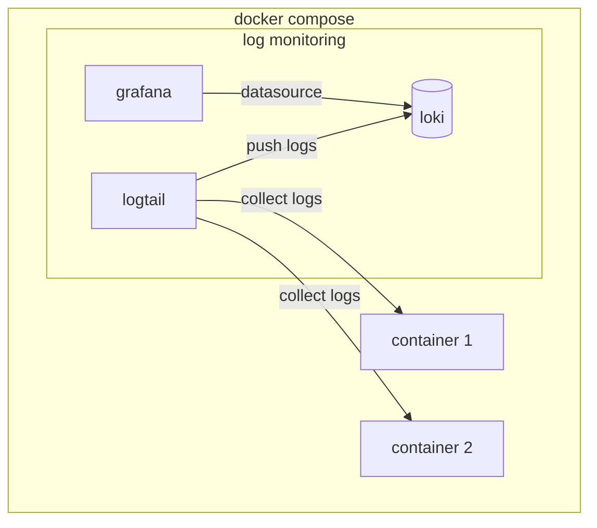

# Monitor docker compose logs

## Usage
* copy this repository

* [use an include](https://docs.docker.com/compose/multiple-compose-files/include/) to add to your existing compose file

* grafana is exposed on port 3000. A datasource is already configured to get logs by containers

### Architecture

This docker compose contains only grafana, loki and logtail

